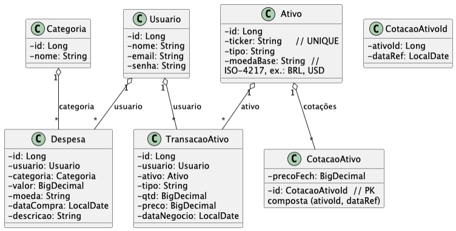

# Duck Bill

Aplicação Spring Boot para controle de despesas pessoais, metas de poupança, tarefas com alertas temporais e investimentos, com frontend Thymeleaf, Spring Security e Flyway.

## Integrantes
- Bruno Carlos Soares RM 559250 - Responsável pelos testes funcionais e validação dos endpoints.
- Lucas Borges de Souza RM 560027 - Desenvolvimento completo da aplicação Spring Boot, controllers e serviços.
- Pedro Henrique Rodrigues RM 560393 - Criação da documentação, diagramas e README do projeto.

## Repositório
- GitHub: `https://github.com/Lucas-Borges27/duckbill-JAVA`

## Pré-requisitos
- Java 17+
- Docker Desktop ou Docker Engine
- Preferencialmente usar `./mvnw`
- Acesso ao Oracle FIAP em `oracle.fiap.com.br:1521/orcl`
- Se necessário, rede/VPN com resolução do host `oracle.fiap.com.br`

## Como rodar

### 1. Clone do repositório
```bash
git clone https://github.com/Lucas-Borges27/duckbill-JAVA.git
cd duckbill-JAVA
```

### 2. Executar com Maven
Essa opção sobe a aplicação diretamente na máquina local.

```bash
./mvnw spring-boot:run
```

Após subir:
- Web: `http://localhost:8080/login`
- API: `http://localhost:8080/api/v1`

Observação:
- O Flyway cria/versiona o schema automaticamente na inicialização.
- A configuração atual de banco está em `src/main/resources/application.properties`.

### 3. Build da imagem Docker
O projeto já possui um `Dockerfile` multi-stage que compila a aplicação com Maven e gera uma imagem final com Java 17.

Comando de build:
```bash
docker build -t duckbill-api:latest .
```

### 4. Executar com Docker
Depois do build, rode o container com:

```bash
docker run -d --name duckbill \
  -p 8080:8080 \
  duckbill-api:latest
```

Comandos úteis:
```bash
docker ps
docker logs -f duckbill
docker stop duckbill
docker rm duckbill
```

Após subir o container:
- Web: `http://localhost:8080/login`
- API: `http://localhost:8080/api/v1`

### 5. Subir para o Docker Hub
Troque `SEU_USUARIO_DOCKERHUB` pelo seu usuário real no Docker Hub.

1. Fazer login:
```bash
docker login
```

2. Criar a tag da imagem:
```bash
docker tag duckbill-api:latest SEU_USUARIO_DOCKERHUB/duckbill-api:latest
```

3. Enviar a imagem:
```bash
docker push SEU_USUARIO_DOCKERHUB/duckbill-api:latest
```

4. Conferir no Docker Hub se a imagem foi publicada.

### 6. Rodar a imagem publicada no Docker Hub
Em qualquer máquina com Docker:

```bash
docker pull SEU_USUARIO_DOCKERHUB/duckbill-api:latest

docker run -d --name duckbill \
  -p 8080:8080 \
  SEU_USUARIO_DOCKERHUB/duckbill-api:latest
```

### 7. Uso em IP público
Se a aplicação estiver rodando em uma VM, servidor ou container remoto com porta `8080` publicada:
- Web: `http://<IP_PUBLICO>:8080/login`
- API: `http://<IP_PUBLICO>:8080/api/v1`

Dica:
- Nos testes web e API, basta trocar `localhost` pelo IP público.
- Para a gravação do vídeo, vale mostrar o `docker build`, o `docker run`, a aplicação abrindo no navegador e depois o CRUD no Postman.

### Testes
- Execute: `./mvnw test`
- Os testes usam a mesma configuração Oracle da aplicação.
- Se o host Oracle não estiver acessível na rede da máquina, o teste de contexto irá falhar.
- Para validar rapidamente os fluxos principais sem depender da suíte inteira, execute:
  `./mvnw -q -Dtest=DashboardServiceTest,MetaServiceTest,TarefaFinanceiraServiceTest test`

## Acesso
- Local: `http://localhost:8080/login`
- Container com IP público: `http://137.131.144.164:8080/login`

### Credenciais seed
- Admin: `admin@duckbill.com` / `admin123`
- User: `user@duckbill.com` / `user123`

### Rotas web principais
- `/login`
- `/app/dashboard`
- `/app/despesas/nova`
- `/app/transacoes/nova`
- `/admin/categorias`
- `/acesso-negado`

### Fluxos recomendados para demonstração
- USER: login, dashboard mensal, criação/edição de despesa e impacto nos insights.
- USER: criação de transação de ativo e leitura do resumo consolidado da carteira.
- API JWT: login, leitura de `/api/v1/me`, metas, tarefas/notificações e despesas.
- ADMIN: tentativa de exclusão de categoria em uso e bloqueio funcional.

## Diagramas
### DER


### Diagrama de Classes


## Vídeo
- URL : [https://youtu.be/I5ZEPi_Vo64](https://youtu.be/I5ZEPi_Vo64)

## Endpoints principais
- Auth: POST `/api/v1/auth/login`, POST `/api/v1/auth/register`, GET `/api/v1/me`
- Usuários admin: POST/GET `/api/v1/usuarios`, GET `/api/v1/usuarios/{id}`
- Categorias: POST/GET /api/v1/categorias
- Despesas: POST/GET `/api/v1/despesas`, GET/PUT/DELETE `/api/v1/despesas/{id}`, GET `/api/v1/despesas/top3`, GET `/api/v1/despesas/insights`
- Metas: POST/GET `/api/v1/metas`, GET/PUT/DELETE `/api/v1/metas/{id}`, POST `/api/v1/metas/{id}/aportes`
- Tarefas: POST/GET `/api/v1/tarefas`, GET/PUT/DELETE `/api/v1/tarefas/{id}`, GET `/api/v1/tarefas/notificacoes`, POST `/api/v1/tarefas/{id}/concluir`
- Ativos: POST/GET /api/v1/ativos, GET /api/v1/ativos/{id}, PUT /api/v1/ativos/{id}
- Transações Ativo: POST/GET `/api/v1/transacoes-ativo`, GET `/api/v1/transacoes-ativo/{id}`, PUT `/api/v1/transacoes-ativo/{id}`, DELETE `/api/v1/transacoes-ativo/{id}`, GET `/api/v1/transacoes-ativo/resumo`
- Cotações de Ativo: POST/GET /api/v1/cotacoes-ativo, GET /api/v1/cotacoes-ativo/{ativoId}/{dataRef}
- Cotações de Moeda: GET /api/v1/cotacoes-moeda, GET /api/v1/cotacoes-moeda/{moeda}/{dataRef}
- Câmbio (serviço utilitário): GET /api/v1/cambio

## Postman
Para testar os endpoints da API, importe uma das coleções abaixo:
- Local: `docs/postman/duckBill-postman-local.json`
- IP público (`137.131.144.164`): `docs/postman/duckBill-postman-ip-publico.json`

Observação: o arquivo `docs/postman/duckBill-postman.json` continua como coleção base original.

## Autenticação da API
As rotas `/api/**` usam JWT Bearer Token. O frontend web em Thymeleaf continua com login por formulário e sessão, mas o app mobile consome apenas a API JWT.

Defina a base antes dos testes:

```bash
export BASE_URL=http://localhost:8080
ou:
export BASE_URL=http://137.131.144.164:8080
```

```bash
curl -X POST $BASE_URL/api/v1/auth/login \
  -H "Content-Type: application/json" \
  -d '{"email":"user@duckbill.com","senha":"user123"}'
```

Resposta esperada:

```bash
{
  "token": "eyJ...",
  "tokenType": "Bearer",
  "expiresIn": 86400,
  "usuario": {
    "id": 2,
    "nome": "Usuário Padrão",
    "email": "user@duckbill.com",
    "role": "ROLE_USER",
    "saldo": 2500.00
  }
```

## Exemplos de uso
Os exemplos abaixo assumem um token JWT válido em `TOKEN` e `BASE_URL` configurado. Para rotas administrativas, faça login com `admin@duckbill.com`.

### 1. Criar usuário
```bash
curl -X POST $BASE_URL/api/v1/usuarios \
  -H "Authorization: Bearer $TOKEN" \
  -H "Content-Type: application/json" \
  -d '{"nome":"João Silva","email":"joao@example.com","senha":"senha123","role":"ROLE_USER"}'
```

### 2. Criar categoria
```bash
curl -X POST $BASE_URL/api/v1/categorias \
  -H "Authorization: Bearer $TOKEN" \
  -H "Content-Type: application/json" \
  -d '{"nome":"Alimentacao"}'
```

### 3. Criar despesa
```bash
curl -X POST $BASE_URL/api/v1/despesas \
  -H "Authorization: Bearer $TOKEN" \
  -H "Content-Type: application/json" \
  -d '{"categoriaId":1,"valor":50.00,"moeda":"BRL","dataCompra":"2026-03-10","descricao":"Jantar"}'
```

### 4. Listar despesas do mês
```bash
curl -H "Authorization: Bearer $TOKEN" \
  "$BASE_URL/api/v1/despesas?mes=2026-03"
```

### 5. Top 3 categorias por gasto
```bash
curl -H "Authorization: Bearer $TOKEN" \
  "$BASE_URL/api/v1/despesas/top3?mes=2026-03"
```

### 6. Insights básicos
```bash
curl -H "Authorization: Bearer $TOKEN" \
  "$BASE_URL/api/v1/despesas/insights?mes=2026-03"
```

### 7. Converter moeda
```bash
curl -H "Authorization: Bearer $TOKEN" \
  "$BASE_URL/api/v1/cambio?from=USD&to=BRL&valor=100"
```

### 8. Criar meta
```bash
curl -X POST $BASE_URL/api/v1/metas \
  -H "Authorization: Bearer $TOKEN" \
  -H "Content-Type: application/json" \
  -d '{"titulo":"Notebook novo","valorObjetivo":4500,"valorGuardado":0,"icone":"laptop","corDestaque":"#67c1ff"}'
```

### 9. Criar tarefa financeira
```bash
curl -X POST $BASE_URL/api/v1/tarefas \
  -H "Authorization: Bearer $TOKEN" \
  -H "Content-Type: application/json" \
  -d '{"titulo":"Pagar cartão","descricao":"Fechar a fatura do mês","valorEstimado":650,"dataLimite":"2026-04-02","notificarEm":"2026-04-01T18:00:00","status":"PENDENTE"}'
```

### 10. Criar ativo
```bash
curl -X POST $BASE_URL/api/v1/ativos \
  -H "Authorization: Bearer $TOKEN" \
  -H "Content-Type: application/json" \
  -d '{"ticker":"PETR4.SA","tipo":"STOCK","moedaBase":"BRL"}'
```

### 11. Criar transação de ativo
```bash
curl -X POST $BASE_URL/api/v1/transacoes-ativo \
  -H "Authorization: Bearer $TOKEN" \
  -H "Content-Type: application/json" \
  -d '{"usuarioId":2,"ativoId":1,"tipo":"BUY","qtd":10.0,"preco":25.50,"dataNegocio":"2026-03-10"}'
```

### 12. Buscar cotação de moeda
```bash
curl -H "Authorization: Bearer $TOKEN" \
  "$BASE_URL/api/v1/cotacoes-moeda/USD/2026-03-10"
```

## Swagger / OpenAPI

A documentação interativa da API está disponível em:

- **Local:** `http://localhost:8080/swagger-ui.html`
- **Container/deploy:** `http://<HOST>:8080/swagger-ui.html`

Para testar endpoints protegidos, clique em **Authorize** no Swagger UI, informe o token JWT no campo `bearerAuth` (obtido em `POST /api/v1/auth/login`) e execute as requisições normalmente.

---

## Integração Multidisciplinar

### Mastering Relational and Non-Relational DB
O schema do banco Oracle é gerenciado por migrações Flyway (`V1` a `V5`), garantindo evolução controlada e rastreável:
- `V1` — schema inicial (USUARIO, CATEGORIA, DESPESA, ATIVO, TRANSACAO_ATIVO, COTACAO_ATIVO, COTACAO_MOEDA)
- `V2` — seed de dados (admin, usuário padrão, categorias)
- `V3` — ajuste de sequences Oracle para colunas IDENTITY
- `V4` — adição da coluna `SALDO` em USUARIO
- `V5` — criação das tabelas META e TAREFA_FINANCEIRA

### DevOps & Cloud Computing
A aplicação é entregue via container Docker com imagem publicada no Docker Hub, possibilitando deploy em qualquer ambiente (VM, Azure, AWS). A pipeline CI/CD no Azure DevOps executa build, testes e deploy automaticamente a cada push na branch principal.

### Mobile Application Development
A API REST em JSON com autenticação JWT foi projetada para ser consumida pelo app mobile React Native. Todos os endpoints `/api/v1/**` retornam JSON padronizado, com suporte a CORS configurável via variável de ambiente `APP_CORS_ALLOWED_ORIGINS`.

### Diagrama de Arquitetura

```
┌─────────────────────────────────────────────────────────┐
│                    Usuários Finais                       │
└──────────┬─────────────────────────┬────────────────────┘
           │                         │
    ┌──────▼──────┐          ┌───────▼───────┐
    │  Mobile App  │          │  Web Browser  │
    │ React Native │          │  (Thymeleaf)  │
    └──────┬──────┘          └───────┬───────┘
           │  JWT Bearer             │  Form Login
           └──────────┬──────────────┘
                      │
         ┌────────────▼────────────┐
         │    API REST Spring Boot  │
         │   (Docker / Azure VM)    │
         │  /api/v1/**  port 8080   │
         │  Swagger: /swagger-ui    │
         └────────────┬────────────┘
                      │  JDBC / JPA
         ┌────────────▼────────────┐
         │    Oracle Database       │
         │  oracle.fiap.com.br      │
         │  Flyway migrations V1-V5 │
         └─────────────────────────┘
```

---

## Sprint 4 — Java Advanced

### Tarefas implementadas

| # | Tarefa | Status |
|---|--------|--------|
| 1 | Dockerfile multi-stage funcional | ✅ |
| 2 | docker-compose.yml com variáveis de ambiente | ✅ |
| 3 | application.properties com `DATASOURCE_URL`, `DATASOURCE_USERNAME`, `DATASOURCE_PASSWORD`, `JWT_SECRET` | ✅ |
| 4 | Swagger/OpenAPI com autenticação Bearer JWT (`/swagger-ui.html`) | ✅ |
| 5 | `GlobalExceptionHandler` atualizado com `EntityNotFoundException` | ✅ |
| 6 | Controllers anotados com `@Tag`, `@Operation`, `@ApiResponse` | ✅ |
| 7 | README atualizado com Integração Multidisciplinar e diagrama de arquitetura | ✅ |

---

## Variáveis de Ambiente

| Variável | Padrão | Descrição |
|----------|--------|-----------|
| `DATASOURCE_URL` | `jdbc:oracle:thin:@oracle.fiap.com.br:1521:orcl` | URL do banco Oracle |
| `DATASOURCE_USERNAME` | `rm560027` | Usuário do banco |
| `DATASOURCE_PASSWORD` | `270304` | Senha do banco |
| `JWT_SECRET` | `duckbill-super-secret-key-...` | Chave de assinatura JWT |
| `JWT_EXPIRATION_MS` | `86400000` | Expiração do token (ms) |
| `APP_CORS_ALLOWED_ORIGINS` | `*` | Origens permitidas no CORS |

---

## Evolução do Projeto

### Sprint 1 (Maturity Level 1 - Recursos)
- Implementação das entidades básicas (Usuario, Categoria, Despesa, Ativo, TransacaoAtivo, CotacaoAtivo, CotacaoMoeda).
- CRUD básico para todas as entidades.
- Persistência com JPA/Hibernate e Oracle Database.
- Validações básicas com Bean Validation.
- Testes funcionais com Postman.

### Sprint 2 (Maturity Level 3 - Hypermedia Controls)
- Evolução inicial da API com Spring HATEOAS.
- Melhorias na arquitetura: separação em camadas (Controller, Service, Repository, Mapper, DTO).
- Validações aprimoradas e tratamento de erros global.
- Coleção Postman atualizada para refletir as mudanças.

### Sprint 3 (Java Advanced - Web + Security + Flyway)
- Frontend web com Thymeleaf e telas funcionais.
- Autenticação por formulário (Spring Security) e senha BCrypt.
- API REST em JSON simplificado para integração com React Native.
- Autenticação JWT para `/api/**` com endpoint de login, cadastro e `/api/v1/me`.
- Perfis `ROLE_USER` e `ROLE_ADMIN` com autorização por rotas.
- Fluxo A: Dashboard mensal com total, top 3 e insights (regra no service).
- Fluxo B: Metas de poupança com CRUD e aporte incremental.
- Fluxo C: Relógio de Ouro com tarefas, janela de notificação e conclusão.
- Fluxo D: Investimentos com formulário, histórico de transações e resumo consolidado da carteira.
- Fluxo E: Admin bloqueia exclusão de categoria com despesas vinculadas.
- Migrações Flyway V1 (schema), V2 (seed), V3 (ajuste de identities), V4 (saldo do usuário) e V5 (metas + tarefas).

### Sprint 4 (Java Advanced — Deploy + Swagger + Qualidade)
- Dockerfile multi-stage e docker-compose.yml para execução containerizada.
- Variáveis de ambiente para todas as credenciais sensíveis (datasource, JWT).
- Swagger/OpenAPI com autenticação Bearer JWT acessível em `/swagger-ui.html`.
- `GlobalExceptionHandler` expandido com `EntityNotFoundException`.
- Controllers anotados com `@Tag`, `@Operation`, `@ApiResponse` para documentação automática.
- README atualizado com diagrama de arquitetura e seção de Integração Multidisciplinar.

## Roteiro do vídeo
Consulte `docs/roteiro-video.md`.

## Checklist rápido de demonstração
- Flyway aplicado com migrations `V1` a `V5`
- Login web funcionando em `/login`
- USER sem acesso a `/admin/**`
- ADMIN com acesso a `/admin/categorias`
- Dashboard exibindo total, top 3 e insights
- Despesa criada refletindo no dashboard
- Transação de ativo refletindo na carteira
- Endpoints JWT respondendo com JSON e protegidos por perfil

## Material para avaliação oral e vídeo
- README com instalação, execução e acesso.
- Diagramas em `docs/images`.
- Roteiro em `docs/roteiro-video.md`.
- Coleções Postman em `docs/postman/duckBill-postman-local.json` e `docs/postman/duckBill-postman-ip-publico.json`.
- Credenciais seed para perfis USER e ADMIN.

## Configuração centralizada
Toda a configuração da aplicação está em `src/main/resources/application.properties`.
Variáveis adicionais da API:
- `JWT_SECRET`
- `JWT_EXPIRATION_MS`
- `APP_CORS_ALLOWED_ORIGINS`

---

## Pipeline CI/CD — Azure DevOps

### Diagrama do fluxo

```
Developer
    │
    │  git push → branch main
    ▼
┌─────────────────────────────────────────────┐
│               Pipeline CI (Duckbill-CI)      │
│                                             │
│  1. Cache Maven (~/.m2)                     │
│  2. mvn package -DskipTests  →  .jar        │
│  3. mvn test  →  JUnit results              │
│  4. Publica artefato: duckbill-app          │
└──────────────────┬──────────────────────────┘
                   │  artefato aprovado
                   ▼
┌─────────────────────────────────────────────┐
│               Pipeline CD (Duckbill-CD)      │
│                                             │
│  1. Download artefato duckbill-app          │
│  2. Deploy → Azure App Service (Java 17)    │
│  3. Injeta variáveis de ambiente            │
└──────────────────┬──────────────────────────┘
                   │
                   ▼
         App em produção
         (Azure App Service Linux)
                   │
                   ▼
         Oracle Database (nuvem FIAP)
```

### Pipeline CI — etapas detalhadas

| # | Step | Descrição |
|---|---|---|
| 1 | Cache Maven | Restaura `~/.m2/repository` usando hash do `pom.xml`. Economiza ~2 min por build. |
| 2 | Use Java 17 | Garante JDK 17 em todos os steps Maven. |
| 3 | mvn package | Compila e gera `target/duckbill-0.0.1-SNAPSHOT.jar` (`-DskipTests`). |
| 4 | mvn test | Executa a suite JUnit. Resultados publicados em `**/surefire-reports/TEST-*.xml`. Pipeline falha se algum teste quebrar. |
| 5 | Copy JAR | Copia o `.jar` para o `Build.ArtifactStagingDirectory`. |
| 6 | Publish artifact | Publica o artefato com nome `duckbill-app` para consumo pelo CD. |

### Pipeline CD — etapas detalhadas

| # | Step | Descrição |
|---|---|---|
| 1 | Trigger automático | CD é disparado quando o CI da branch `main` conclui com sucesso. |
| 2 | Download artifact | Baixa o `.jar` publicado pelo CI (artefato `duckbill-app`). |
| 3 | AzureWebApp@1 | Deploy do `.jar` no App Service com runtime `JAVA|17-java17` (Linux). |
| 4 | App Settings | Injeta variáveis de ambiente no App Service: datasource, JWT, CORS, profile. |

### Variáveis no Azure DevOps Library

Configurar no Variable Group `duckbill-secrets` (cadeado nas secretas):

| Variável | Descrição | Secreta |
|---|---|---|
| `AZURE_SUBSCRIPTION` | Nome do service connection do Azure | Não |
| `AZURE_WEBAPP_NAME` | Nome do App Service no Azure | Não |
| `DATASOURCE_URL` | JDBC URL do Oracle | Sim |
| `DATASOURCE_USERNAME` | Usuário do banco Oracle | Sim |
| `DATASOURCE_PASSWORD` | Senha do banco Oracle | Sim |
| `JWT_SECRET` | Chave secreta para assinar tokens JWT | Sim |
| `JWT_EXPIRATION_MS` | Expiração do token em ms (ex: `86400000`) | Não |
| `APP_CORS_ALLOWED_ORIGINS` | Origins permitidas no CORS | Não |

### Como configurar no Azure DevOps

1. Acesse **dev.azure.com** → org `RM559250` → projeto `DuckBill`
2. **Pipelines → Library → + Variable Group** → crie `duckbill-secrets` com todas as variáveis acima
3. **Pipelines → New Pipeline** → GitHub → repo `duckbill-JAVA` → **Existing Azure Pipelines YAML** → `azure-pipelines-ci.yml` → salve como `Duckbill-CI`
4. Crie um segundo pipeline apontando para `azure-pipelines-cd.yml` → salve como `Duckbill-CD`
5. **Pipelines → Environments** → crie o environment `Desenvolvimento`
6. **Project Settings → Service connections** → crie um service connection **Azure Resource Manager** → use o nome na variável `AZURE_SUBSCRIPTION`
7. Execute o CI manualmente na primeira vez; o CD dispara automaticamente em seguida
