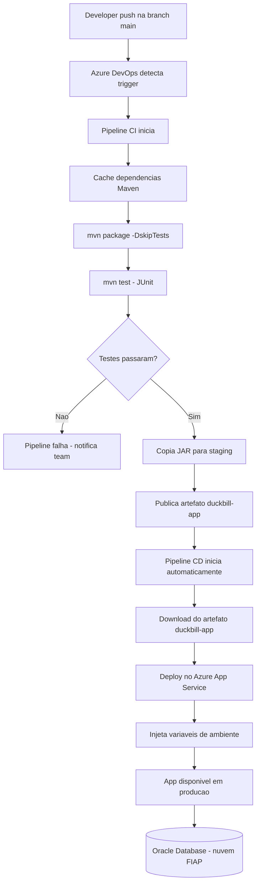

# Diagrama da Pipeline CI/CD — Duckbill

## Fluxo completo (Mermaid)

---

## Tabela de etapas

| # | Nome | Pipeline | Ferramenta | Finalidade |
|---|---|---|---|---|
| 1 | Push na branch main | — | Git / GitHub | Desenvolvedor envia código; dispara o trigger do CI |
| 2 | Cache Maven | CI | Azure Pipelines `Cache@2` | Restaura `~/.m2/repository` com base no hash do `pom.xml`. Economiza ~2 min de download |
| 3 | Configurar Java 17 | CI | `JavaToolInstaller@0` | Garante que o agente Ubuntu use JDK 17 |
| 4 | Build | CI | `Maven@4` — `mvn package -DskipTests` | Compila e gera `duckbill-0.0.1-SNAPSHOT.jar` |
| 5 | Testes | CI | `Maven@4` — `mvn test` | Executa DespesaServiceTest, MetaServiceTest, TarefaFinanceiraServiceTest, DuckbillApplicationTests. Publica resultados JUnit |
| 6 | Copiar JAR | CI | `CopyFiles@2` | Move o `.jar` para o diretório de staging do agente |
| 7 | Publicar artefato | CI | `PublishBuildArtifacts@1` | Persiste `duckbill-app` disponível para consumo pelo CD |
| 8 | Download artefato | CD | `download` (resource pipeline) | Recupera o `.jar` publicado pelo CI |
| 9 | Deploy App Service | CD | `AzureWebApp@1` | Envia o `.jar` para o Azure App Service (runtime `JAVA\|17-java17`, Linux) |
| 10 | Injeção de variáveis | CD | `appSettings` (AzureWebApp@1) | Injeta `DATASOURCE_URL`, `DATASOURCE_USERNAME`, `DATASOURCE_PASSWORD`, `JWT_SECRET` e demais vars do variable group `duckbill-secrets` |
| 11 | App em produção | — | Azure App Service | Aplicação disponível publicamente via URL do App Service |
| 12 | Banco de dados | — | Oracle (nuvem FIAP) | Persistência gerenciada por Flyway (migrações V1–V5) |

---

## Arquivos da pipeline

| Arquivo | Tipo | Trigger |
|---|---|---|
| `azure-pipelines-ci.yml` | CI | Push na branch `main` |
| `azure-pipelines-cd.yml` | CD | Conclusão bem-sucedida do CI na branch `main` |
